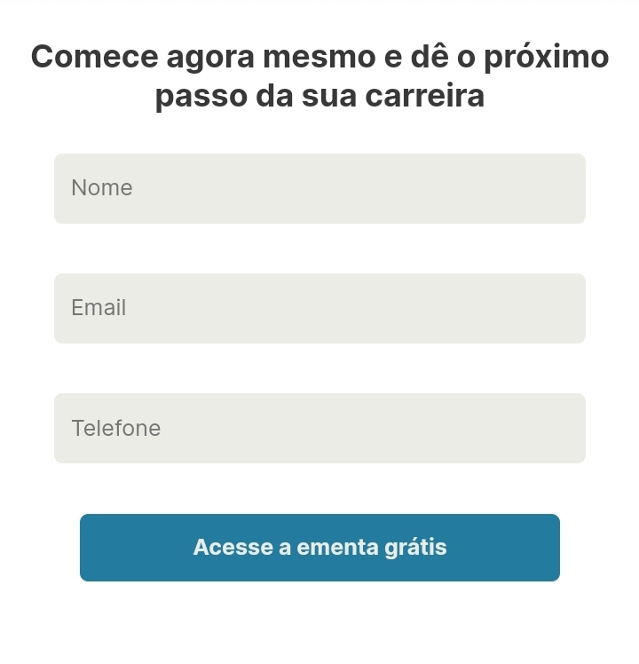
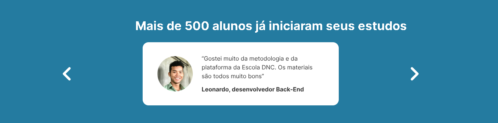

Ìndice:

<a href="#desc">Descrição</a>
  

<a href="#fp">Funcionalidades Principais</a>

<a href="#cum">Como utilizar</a>

<a href="#ctt">Contato</a>

<a href="#pc">Palavras Chave</a>

  

# Página de Captura de Clientes
projeto de landing page da escola dnc realizado por mim do curso formação em tecnologia 
Landing Page de Captura de Clientes

<h1 id="desc">Descrição:</h1>
Repositório contendo um projeto web de uma Landing Page de Captura de Clientes desenvolvido com HTML, CSS e JavaScript. Esta página tem como objetivo atrair e converter clientes interessados nos produtos e serviços da escola DNC.

<h1 id="fp">Funcionalidades Principais:</h1>

<ul>
<li>Formulário de Cadastro Intuitivo.</li>

<li>Design Responsivo para todos os dispositivos:

Desktop

Mobile

</li>
<li>Integração dinâmica de um carrossel com JavaScript para uma experiência interativa.
</li>

</ul>

<h1 id="cum">Como Utilizar:</h1>

<ul>

<li><a href="https://landig-page-dnc.netlify.app/"> Explore a Landing Page e experimente o formulário de cadastro aqui.</a> </li> 

</ul>

<h1 id="ctt">Contato:</h1>

<ul>
<li> Dúvidas ou sugestões? Entre em contato comigo. Agradeço por explorar nossa Landing Page de Captura! 🚀</li>
<li> contato: cttdarlv@yahoo.com</li>
</ul>

<h1 id="pc">Palavras-Chave:</h1>

<ul>
<li> #LandingPage #CapturadeClientes #HTML #CSS #JavaScript #FormulariodeCadastro #DesignResponsivo</li>
</ul>
